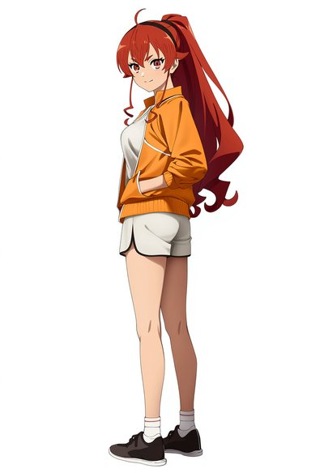

# astrbot_plugin_meme_manager_plus v3.8.4

AI 心情表情管理器 — 自动分析 Bot 回复的情绪与表达欲望，双级概率独立判定，智能生成风格多变的表情图片。

## NovelAI 角色扮演生图效果展示

> **Opus 会员（$25/月）无限生图**：默认配置（V4.5 Full, 832×1216, 28 步）完全在 Opus 免费额度内，不消耗 Anlas。只要预设好角色标签，即可无限量自动生图——开了会员就是无限玩。
>
> 预设角色外貌 + LLM 根据对话生成情景 TAG + 日程穿搭注入 → 连贯的角色扮演插画。穿搭随场景自动切换，颜色、款式等细节跨图保持一致。

<p align="center">
  
  
  
  
  
</p>
<p align="center">
  <sub>上课 · 制服 → 运动 · 运动服 → 换装 · 便装 → 居家 · 开衫 → 睡前 · 睡裙</sub>
</p>

同一角色在不同对话场景下自动生成——穿搭由 `life_scheduler` 提供日程穿搭，情景适配 LLM 根据对话上下文临时调整（如"一起泡澡吧"→浴巾、"去运动"→运动服），且上次输出的穿着细节（颜色、材质）会自动传递给下一次判断，保持连贯。

**发送模式**：支持以 **表情包（GIF 贴纸）** 或 **原图** 两种方式发送，心情表情和 NovelAI 各有独立开关。表情包模式自动等比缩放到正方形，适合聊天中嵌入；原图模式保留完整画质。`/ni 0 <标签>` 可快速切换小图模式。更多参数（模型、分辨率、采样器、CFG、种子、参考图模式等）均可在配置面板调整。

## 功能特性

- **双级概率系统**：表达欲望评分 + LLM 生图概率独立判定，可分别开关和调节
- **先发后生**：触发后立即从图库抽图发送，LLM 生图在后台异步执行，不阻塞发送
- **双引擎生图**：支持 Gemini API 和 Grok (xAI) API，可在配置中切换
- **图生图 / 文生图**：心情目录有参考图时以其为风格参考，目录为空时纯提示词生成
- **自动图库积累**：生成的图片自动保存到对应心情目录
- **图库上限管理**：达到上限后停止自动搜图和 LLM 生图，仅从已有图库随机抽取
- **自定义心情**：在 `memes/` 下新建文件夹即可添加心情标签，支持中英文
- **冷却机制**：按群组或会话独立冷却，防止刷屏
- **自动搜图入库**：定时从 Booru 图站（danbooru / yande.re / konachan）或 Pixiv 搜索角色图片，LLM 自动判断心情分类后入库
- **Pixiv 搜索**：支持 3 种搜索模式（标签部分匹配 / 精确匹配 / 标题简介搜索）
- **R-18 开关**：Pixiv 专用精确过滤，其他站依赖 LLM 审核
- **手动搜图**：`/搜图 N` 立即搜索指定数量图片入库（上限 50）
- **删图命令**：`/删图` 支持附带图片、回复图片、或删除最近发送的表情图
- **NovelAI 生图模式**：独立的角色扮演生图模式，开启后替代心情表情流程
- **LLM 标签补全**：根据对话内容自动补全角色标签（可关闭，直接用基础标签生图）
- **R18 标签模式**：开启后 LLM 根据对话语境生成 NSFW 标签，自动追加矛盾负向标签
- **参考图三模式**：Vibe Transfer / img2img / Precise Reference（仅 V4.5）
- **NovelAI 全参数暴露**：种子、CFG Rescale、噪声调度、Decrisper、SMEA、Variety Boost 等
- **独立小图模式**：心情表情和 NovelAI 各有独立的表情包模式开关
- **安全模式**：非 R18 时可独立控制 SFW 约束，关闭后 LLM 自由生成
- **穿搭 tag 注入**：从 life_scheduler 插件获取今日穿搭，LLM 转换为 NovelAI tag 后注入
- **穿搭情景适配**：LLM 根据对话历史（最近 N 条消息）判断是否临时修改穿搭（如泡澡→浴巾），保持穿着连续性（颜色、材质、款式细节跨生图保留），仅影响当次生图
- **权重控制**：穿搭 tag 支持独立的 NovelAI 权重参数
- **Opus 免费优化**：默认配置（V4.5 Full, 832×1216, 28步）在 Opus 会员下免费无限生图

## 安装

通过 AstrBot 插件市场搜索 `meme_manager_plus` 安装，或手动安装：

```bash
cd /path/to/AstrBot/data/plugins
git clone https://github.com/Sloan-YXT/astrbot_plugin_meme_manager_plus
```

重启 AstrBot，依赖会自动安装。

### 可选依赖

| 插件 | 用途 | 是否必须 |
|------|------|----------|
| `astrbot_plugin_life_scheduler` | 提供每日穿搭数据，供 NovelAI 穿搭 tag 注入和情景适配使用 | 否 |

穿搭相关功能（`novelai_use_outfit`、`novelai_outfit_adapt`）依赖 `life_scheduler` 插件提供穿搭描述。未安装时这些功能自动跳过，不影响其他功能。`life_scheduler` 的 `/改穿搭` 命令可实时修改穿搭，本插件会自动检测变化并重新生成 tag。

### 与 meme_manager 的关系

本插件的心情表情模式（情绪分析 + 大模型生图 + Booru/Pixiv 爬图入库）借鉴了 [astrbot_plugin_meme_manager](https://github.com/zouyonghe/astrbot_plugin_meme_manager) 的设计思路，在此基础上增加了双级概率、先发后生、Grok 引擎等改进。NovelAI 角色扮演生图模式则是本插件的原创功能，通过 LLM 标签补全 + 穿搭注入 + 情景适配实现连贯的角色插画生成。两个插件可以共存，互不影响。

## 快速开始

插件有两种工作模式，任选其一：

### 模式 A：心情表情模式

Bot 回复后自动分析情绪，从图库抽取匹配心情的表情图发送，并可选调用 Gemini/Grok 生成新图入库。

1. 打开 AstrBot 管理面板 → 插件配置 → `AI 心情表情管理器 Plus`
2. **LLM 分析设置** → 选择一个提供商作为情绪分析用 LLM（推荐 Gemini Flash 等快速模型）
3. **大模型生图设置** → 选择一个提供商，并选择生图引擎（`gemini` 或 `grok`）
4. 在 `memes/` 各心情目录下放入几张参考图（如 `memes/happy/` 放开心的图）
5. 发送消息触发 Bot 回复，插件会自动分析情绪 → 按表达欲望评分决定是否发图，如果决定发图，会从心情文件夹下抽一张发，没图就不发；每次决定发图后，概率判断是否触发LLM生图，触发后在对应心情文件夹下生成一张图;
6. 调整**触发概率设置**中的「表达欲望门槛」控制发图频率（默认 0.65，越低越频繁）
7. 大模型生图有独立概率来控制token消耗;设置自动下载后，每次从源拉图到LLM判断的心情中，生图和拉图都放在一起，判断出需要发送表情时在对应表情文件夹抽一张发送。
8. 如果不想用生图可以把大模型触发概率调成0，纯靠pixiv/其他站搜索图来玩;
9. 这种模式是V2时的玩法，更自然带入的玩法还是推荐novelai模式;
> 不放参考图也可以工作：有图时走图生图（保持风格一致），空目录走纯文生图。生成的图会自动保存到对应目录，图库会越用越丰富。

### 模式 B：NovelAI 角色扮演生图（默认）

Bot 回复后按概率触发，LLM 根据对话内容自动补全角色标签，调用 NovelAI API 生成角色插画。**开启后替代心情表情模式**。

> **重要**：NovelAI 模式的**触发概率、冷却时间、图片缓存上限**均与心情表情模式完全独立，互不影响。修改心情表情的冷却/概率不会影响 NovelAI 模式，反之亦然。

1. 打开 AstrBot 管理面板 → 插件配置 → `AI 心情表情管理器 Plus`
2. **NovelAI 生图模式** → 开启「启用 NovelAI 模式」
3. 填入 NovelAI API Key（在 [novelai.net](https://novelai.net) 账号设置中获取）
4. 填写「角色基础标签」，如 `1girl, {{{solo}}}, {{{eris boreas greyrat}}}, mushoku tensei`
5. 发送消息触发 Bot 回复，插件会按概率自动生图并发送(如果你用免费参数这里概率不是为了省额度了，单纯是免打扰了，我一般都开1);该模式LLM不再分析心情，而是输出一个分析对话输出的场景tag，最终给novelai的tag是{预制tag},{穿搭tag},{LLM输出场景tag} 这样实现灵活的玩法；穿塔tag依赖astrbot_plugins_life_scheduler插件，强烈推荐！固定了穿搭会让你的bot行为极其拟人连贯，比单纯用场景好玩得多。
6. 此外插件还集成了/ni命令直接覆盖标签生图，可以作为一个全面的novelai插件使用。
**Opus 会员免费生图**：默认配置（V4.5 Full, 832×1216, 28 步, 纯文生图）在 Opus 会员（$25/月）下免费无限使用。注意如果想提升图片质量请勿随便改参数，会很快用完你的额度，建议去官网试一下什么参数是什么额度再去改参数，我们这玩法最好玩的一点就是无限白嫖novelai的免费额度;（模型和tag随便改，和收费无关）

**可选：启用参考图**（提升角色一致性）：
1. 在配置面板上传一张角色参考图
2. 开启「启用参考图」开关
3. 选择参考图模式：
   - **Vibe Transfer**（推荐）：提取角色风格特征引导生图，V4+ 编码收 2 Anlas
   - **img2img**：以参考图为底图直接变换，收费
   - **Precise Reference**：精确角色参考，仅 V4.5 模型，收 5 Anlas

## 配置说明

### 大模型生图 API 设置

| 配置项 | 说明 | 默认值 |
|--------|------|--------|
| provider_id | 生图模型提供商（自动读取密钥/端点） | — |
| image_provider_type | 生图引擎：`gemini` 或 `grok` | gemini |
| model | 模型名称（留空用默认） | Gemini: gemini-2.0-flash-exp / Grok: grok-imagine-image |
| timeout | 请求超时（秒） | 60 |
| resolution | 图片分辨率 | 1K |
| aspect_ratio | 图片长宽比 | 1:1 |

### LLM 分析设置

| 配置项 | 说明 | 默认值 |
|--------|------|--------|
| mood_provider_id | 情绪分析 / 图片分类 / 筛选用的 LLM 提供商 | 使用默认提供商 |
| custom_mood_prompt | 自定义分析提示词（需含 `{categories}` 占位符） | 内置模板 |
| llm_timeout | LLM 请求超时（秒） | 30 |

### 触发概率设置

| 配置项 | 说明 | 默认值 |
|--------|------|--------|
| expression_threshold | 表达欲望门槛（0.0-1.0），越低越频繁触发 | 0.65 |
| llm_generation_enabled | 是否启用大模型生图 | true |
| llm_generation_probability | 大模型生图概率（0-100） | 30 |

**双级概率机制**：
1. 第一级（表达欲望）：LLM 对每条回复评估表达欲望评分 (0.0-1.0)，`score >= threshold` 时触发发图
2. 第二级（生图概率）：发图后独立判定是否调用 API 生成新图入库
3. 无论是否生图，都从对应心情目录随机抽取一张发送

### 大模型生图设置

| 配置项 | 说明 | 默认值 |
|--------|------|--------|
| image_prompt_template | 生图提示词模板（`{mood}` 替换为心情） | 内置模板 |
| reference_prompt_addon | 有参考图时的附加提示词 | 内置模板 |
| sticker_mode | 表情包模式（200x200 小图发送） | true |

### 图库与冷却

| 配置项 | 说明 | 默认值 |
|--------|------|--------|
| max_library_size | 图库总上限（0=不限制） | 0 |
| cooldown_seconds | 冷却时间（秒） | 60 |
| per_group | 按群组冷却（false=按用户冷却） | true |

### 自动搜图设置

| 配置项 | 说明 | 默认值 |
|--------|------|--------|
| auto_update_enabled | 启用自动搜图 | false |
| auto_update_interval_hours | 搜图间隔（小时），最小 0.5 | 6 |
| auto_update_search_tags | Booru 搜索标签（空格分隔） | eris_greyrat solo |
| auto_update_images_per_cycle | 每次搜索图片数（1-50） | 5 |
| auto_update_source | 图片来源：danbooru / yandere / konachan / pixiv | danbooru |
| auto_update_min_score | 最低评分过滤（Pixiv 使用收藏数） | 10 |
| auto_update_filter_prompt | 搜图筛选提示词（留空不筛选） | — |
| pixiv_refresh_token | Pixiv Refresh Token（使用 Pixiv 图源时必填） | — |
| pixiv_search_keyword | Pixiv 搜索关键词（填写后替代搜索标签） | — |
| pixiv_search_target | Pixiv 搜索模式 | partial_match_for_tags |
| pixiv_allow_r18 | 允许 R-18（仅 Pixiv 精确过滤，其他站依赖 LLM 审核） | false |

### NovelAI 生图设置

开启后替代心情表情流程。注意：1.novelai配置完全独立于心情表情模式的配置，可视为独立模式;2.Opus 会员使用默认配置可**免费无限生图**。

> **注意**：以下所有配置（触发概率、冷却时间、图片缓存上限、小图模式等）均为 NovelAI 模式**独立配置**，与上方心情表情模式的同名设置完全无关、互不影响。

#### 基础配置

| 配置项 | 说明 | 默认值 |
|--------|------|--------|
| novelai_enabled | 启用 NovelAI 模式 | true |
| novelai_llm_provider_id | NovelAI 专用 LLM 提供商（留空回退到 LLM 分析设置的提供商） | — |
| novelai_api_key | NovelAI API Token | — |
| novelai_model | 生图模型 | nai-diffusion-4-5-full |
| novelai_llm_enabled | 启用 LLM 标签补全（关闭后只用基础标签） | true |
| novelai_safe_mode | 安全模式（非 R18 时强制 SFW 约束，关闭后 LLM 自由生成） | true |
| novelai_use_outfit | 注入穿搭 tag（从 life_scheduler 获取穿搭） | false |
| novelai_outfit_weight | 穿搭 tag 权重（1.0=正常不加权，>1.0=加强） | 1.0 |
| novelai_outfit_adapt | 穿搭情景适配（对话历史暗示换装时临时修改穿搭） | false |
| novelai_outfit_history | 穿搭适配参考对话条数 | 20 |
| novelai_base_tags | 角色基础标签（逗号分隔） | 1girl, {{{solo}}}, ... |
| novelai_negative_prompt | 负面提示词 | lowres, bad anatomy... |
| novelai_custom_tags | 自定义追加标签（通用，每次生图都带） | — |
| novelai_probability | 触发概率 (0-100) | 30 |
| novelai_cooldown_seconds | 独立冷却时间（秒） | 60 |
| novelai_sticker_mode | 小图模式（自动生图 + `/ni 0` 命令） | true |
| novelai_direct_model | `/ni` 原图模式专用模型（留空用默认模型） | — |
| novelai_max_cache | 图片缓存上限（0=不限制） | 100 |

#### R18 与安全模式

| 配置项 | 说明 | 默认值 |
|--------|------|--------|
| novelai_safe_mode | 安全模式（非 R18 时强制 SFW 约束）。关闭后 LLM 自由生成，R18 开启时本项无效 | true |
| novelai_r18 | 启用 R18 模式（LLM 生成 NSFW 标签 + 动态负向标签） | false |
| novelai_r18_custom_tags | R18 专用追加标签（仅 R18 开启时生效） | — |
| novelai_tag_prompt | 自定义 LLM 补全提示词（需含 `{base_tags}` 和 `{bot_reply}`） | 内置模板 |

#### 图片尺寸与采样

| 配置项 | 说明 | 默认值 |
|--------|------|--------|
| novelai_width | 图片宽度 | 832 |
| novelai_height | 图片高度 | 1216 |
| novelai_steps | 生成步数（Opus 免费上限 28） | 28 |
| novelai_scale | 提示词引导强度 | 5.5 |
| novelai_sampler | 采样器 | k_euler_ancestral |
| novelai_seed | 随机种子（-1=随机） | -1 |

#### 高级参数

| 配置项 | 说明 | 默认值 |
|--------|------|--------|
| novelai_quality_toggle | 质量标签 | true |
| novelai_uc_preset | UC 预设（0=Heavy, 1=Light, 2=Human Focus, 3=None） | 0 |
| novelai_cfg_rescale | CFG Rescale（0-1，仅 V4+） | 0.0 |
| novelai_noise_schedule | 噪声调度（仅 V4+） | karras |
| novelai_dynamic_thresholding | Decrisper（仅 V4+） | false |
| novelai_smea | SMEA（仅 V3） | false |
| novelai_smea_dyn | 动态 SMEA（仅 V3） | false |
| novelai_variety_boost | Variety Boost（0=关闭，推荐 19-26，仅 V4+） | 0.0 |

#### 参考图设置

在配置面板上传参考图后，开启「启用参考图」即可使用。

| 配置项 | 说明 | 默认值 |
|--------|------|--------|
| novelai_reference_image | 角色参考图（配置面板上传） | — |
| novelai_use_reference | 启用参考图 | false |
| novelai_reference_mode | 参考图模式：vibe_transfer / img2img / director | vibe_transfer |

**Vibe Transfer**（提取风格/角色特征引导，V4+ 收 2 Anlas）：
- `novelai_reference_strength`：引导强度（0-1），默认 0.6
- `novelai_reference_info_extracted`：信息提取量（0-1），默认 1.0

**img2img**（以参考图为底图变换，收费）：
- `novelai_img2img_strength`：变换强度（0-1），默认 0.6
- `novelai_img2img_noise`：噪声强度（0-1），默认 0.0

**Precise Reference**（精确角色参考，仅 V4.5，收 5 Anlas）：
- `novelai_director_strength`：参考强度（0-1），默认 0.5
- `novelai_director_fidelity`：保真度（0-1），默认 0.5
- `novelai_director_info_extracted`：信息提取量（0-1），默认 1.0

> 选择 director 模式但模型不是 V4.5 时，会自动降级为 Vibe Transfer。

## 图库

图库位于插件目录下的 `memes/`，首次运行自动创建预设心情目录。

### 自定义心情

直接在 `memes/` 下新建文件夹即可：

```
memes/
├── happy/        # 有图 → 图生图
├── sad/          # 空目录 → 文生图
├── 摸鱼/         # 支持中文名
└── sleepy/       # 随意添加
```

- 文件夹名 = 心情标签名，LLM 会从所有文件夹名中选择匹配的心情
- 放入参考图 → 图生图模式（以参考图风格生成）
- 不放图片 → 文生图模式（纯提示词生成）
- 生成的图片自动保存到对应目录，逐步积累图库
- 以 `.` 或 `__` 开头的目录（如 `__pycache__`）会被自动忽略
- 支持格式：jpg, jpeg, png, gif, webp, bmp

### 心情表情模式工作流程

```
Bot 回复文本
    ↓
冷却检查 → 通过
    ↓
独立 LLM 分析 → 输出 score|mood（如 0.85|happy）
    ↓
第一级：score >= expression_threshold ?
    ↓ 通过
从该心情目录随机抽取一张 → 立即发送
    ↓
第二级：LLM 生图概率判定（独立，不阻塞发送）
    ├─ 命中 + 图库未满 → 调用 Gemini/Grok API 生图 → 保存到图库
    └─ 未命中或图库已满 → 跳过
```

### NovelAI 工作流程

```
Bot 回复文本
    ↓
记录对话消息到历史（每次都记录，用户输入 + Bot 回复）
    ↓
冷却检查 → 概率判定 (novelai_probability)
    ↓ 命中
LLM 分析对话内容，补全角色标签（表情/动作/场景）
    ↓
合并: 基础标签 + LLM 补全 + 自定义标签 [+ R18 标签] [+ 穿搭 tag]
  （穿搭情景适配：LLM 参考最近 N 条对话 + 上次适配 tag 判断是否换装，保持颜色/款式连续性）
    ↓
调用 NovelAI API 生图（+ 参考图引导，如已启用）
    ↓
发送图片 + 保存到 novelai/ 目录（自动触发）
                    或 novelai/generated/ 目录（/ni 手动触发）
```
**LLM分析回退链** 插件可自己配置用于心情分析和novelai的tag分析的LLM，如果未配置会做 novelai_llm_provider_id -> mood_provider_id -> 配置文件provider_id的回退；但是想用生图的话生图provider_id一定要配。
### 自动搜图流程

```
定时触发（每 T 小时）或手动 /搜图 N
    ↓
Booru API 或 Pixiv API 搜索
    ↓
过滤：评分/收藏数 >= min_score，去重，R-18 开关（仅 Pixiv 精确过滤）
    ↓
并发下载图片（信号量=8，大图自动压缩）
    ↓
（可选）LLM 筛选：根据 filter_prompt 判断 PASS/REJECT
    ↓
LLM Vision 分析每张图片的表情/心情
    ↓
匹配到心情标签 → 保存到对应目录
```

## 命令

| 命令 | 说明 |
|------|------|
| `心情表情状态` | 查看插件状态和图库统计 |
| `心情表情刷新` | 重新扫描图库目录 |
| `搜图 N` | 手动搜索 N 张图片并分类入库（默认 5，上限 50） |
| `自动搜图开启` | 开启自动搜图入库 |
| `自动搜图关闭` | 关闭自动搜图 |
| `自动搜图立即执行` | 立即执行一次搜图 |
| `删图` | 删除表情图（附带图片 / 回复图片 / 最近发送的） |
| `ni <标签>` | 直接用指定标签调用 NovelAI 生图（原图模式），图片存入 `novelai/generated/` |
| `ni 0 <标签>` | 同上，但以小图 GIF 贴纸模式发送 |
| `ni重置` | 清空 NovelAI 对话历史和穿搭缓存 |
| `穿搭` | 查看穿搭/适配诊断信息 |
| `穿搭 1` | 开启穿搭 tag 注入 |
| `穿搭 0` | 关闭穿搭 tag 注入（缓存保留） |
| `存tag <名称>` | 保存当前正负标签 + 穿搭缓存为命名预设 |
| `应用tag <名称>` | 加载预设，替换当前标签和穿搭缓存（不重新调 LLM） |
| `查看所有tag` | 列出所有已保存的 tag 预设 |
| `查看tag <名称>` | 查看某个预设的详细内容 |
| `删除tag <名称>` | 删除一个已保存的 tag 预设 |

## 更新日志

### v3.8.4

- **NovelAI 独立 LLM 配置**：新增 `novelai_llm_provider_id`，NovelAI 标签补全、穿搭转换、情景适配可使用独立的 LLM 提供商，不再强制共用心情分析的 LLM。留空时自动回退到 `mood_provider_id`
- **NovelAI 默认开启**：`novelai_enabled` 默认值改为 `true`，新用户拉取插件后直接进入 NovelAI 模式
- **默认标签同步**：`novelai_base_tags`、`novelai_negative_prompt`、`novelai_custom_tags`、`novelai_scale` 默认值更新为当前调优后的配置，新用户开箱即用
- **修复带权重标签去重失败**：LLM 输出 `adult eris greyrat` 与 base_tags 中的 `((adult eris greyrat:1.2))` 无法匹配去重。新增 `_normalize_tag()` 去除权重语法后比较
- **`/ni` 命令日志补全**：`run_direct` 现在同时输出正向和负向标签日志，方便调试
- **图库扫描容错**：`library_manager.refresh()` 单个心情目录扫描失败（权限/损坏）不再导致整个图库刷新崩溃
- **`/改穿搭` 命令修复**：清理回复消息中混入的 @mention 和旧穿搭引用内容，防止 LLM 把旧穿搭当换装要求；prompt 新增强制遵守用户换装要求的规则

### v3.8.3

- **穿搭午夜回退**：`_get_raw_outfit()` 当天日程不存在时自动往前回退最多 3 天，避免过了午夜穿搭丢失（与 life_scheduler 的 `_get_latest_data` 逻辑一致）
- **负向标签日志完善**：每次生图始终打印完整负向标签，不再仅在有 `extra_negative` 时才输出

### v3.8.2

- **修复 `/穿搭` 诊断并发安全**：`_last_adapted_tags` 和 `_msg_history` 在诊断输出时做 snapshot，防止后台生图任务并发修改导致 RuntimeError

### v3.8.1

- **应用tag 穿搭同步 life_scheduler**：`/应用tag` 现在会把穿搭原文写回 life_scheduler 的 schedule 对象，防止 `_refresh_outfit_tags` 检测到不一致而重新 LLM 转换
- **新增 `/删除tag` 命令**：删除已保存的 tag 预设
- **Tag 预设代码重构**：抽取 `_get_outfit_snapshot`、`_write_outfit_to_life_scheduler` 公共方法，settings key 用常量元组统一管理，消除重复代码
- **修复预设 JSON 健壮性**：`_load_tag_preset` 增加 `settings` 字段校验；`/查看tag`、`/查看所有tag` 改用 `.get()` 防止 KeyError

### v3.8.0

- **Tag 预设管理**：新增 `/存tag`、`/应用tag`、`/查看所有tag`、`/查看tag` 四个命令，可保存和恢复调好的正负标签 + 穿搭缓存。恢复时直接写入穿搭缓存，不重新调 LLM 生成，适合保存"炼丹"成果
- **默认标签同步**：`settings.py` 默认值与配置面板 schema 对齐（base_tags、negative_prompt、custom_tags）

### v3.7.1

- **修复 LLMClient asyncio.Lock 事件循环错误**：`_session_lock` 在模块加载时创建，插件热重载或事件循环切换时导致 `RuntimeError`。改为懒初始化，确保 Lock 在当前事件循环中创建
- **修复自动搜图 `_seen_ids` 并发修改竞态**：多个 `_process_one` 任务并发写入 `_seen_ids` 无锁保护，可能导致数据丢失。新增 `_seen_lock` 保护所有修改操作
- **改进 `_seen_ids` 超限策略**：超限时从磁盘重建后与内存 ID 合并，不再丢弃未持久化的临时 ID
- **修复哈希索引异常静默吞掉**：`library_manager._build_hash_index` 中文件读取失败时无日志输出，排查困难。改为 debug 级别记录失败文件名和原因

### v3.7.0

- **移除标签历史功能**：移除 `novelai_tag_history_size`、`novelai_history_weight` 配置项及 `tag_cache/` 持久化目录。标签历史上下文不再注入 LLM 补全
- **穿搭情景适配升级**：`_adapt_outfit_tags` 改为基于对话消息历史判断是否换装，而非仅看当前用户输入。LLM 可参考最近 N 条对话消息（用户输入 + Bot 回复）来判断场景变化
- **穿搭适配连续性**：新增 `_last_adapted_tags` 按会话缓存上次适配输出的 tags，下次适配时作为上下文传给 LLM，保持穿着细节连续（颜色、材质、款式跨生图不丢失）
- **穿搭适配细节强化**：prompt 要求 LLM 输出最大化细节的穿着标签（如 `black_pleated_skirt` 而非 `skirt`），并在穿着变化时只修改对话中明确变化的部分
- **新增配置项 `novelai_outfit_history`**：控制穿搭情景适配参考的对话条数，默认 20 条，无上限
- **对话消息自动记录**：每次 Bot 回复时自动记录用户输入和回复内容到内存（按会话隔离，最多 50 条），供穿搭情景适配使用
- **R18 职责分离重构**：`R18_TAG_ADDON` 精简为只负责氛围/动作 tag，穿着状态交给穿搭系统管理。新增对话强度匹配逻辑，移除硬编码的角色特定逻辑，改为用户通过 `novelai_r18_custom_tags` 自定义
- **R18 穿搭联动**：穿搭全为"无"时自动注入预设标签（可在配置面板自定义），仅 R18 模式生效
- **穿搭转 tag 支持 R18 模式**：`_refresh_outfit_tags` 在 R18 模式下根据穿搭描述自动判断身体暴露程度并输出对应 tag
- **LLM 标签补全禁止生成衣着 tag**：`DEFAULT_TAG_PROMPT` 新增明确禁止规则，LLM 补全时不再生成服装、袜子/腿部穿着、头饰/发饰、鞋子、配饰类 tag，避免与穿搭注入系统产生冲突
- **LLM 标签去重**：LLM 补全输出的 tag 与 `base_tags` 自动比对，已存在的标签不再重复拼接
- **代码清理**：移除所有废弃的 `getattr` 防御代码（`novelai_generator`、`auto_updater`、`main`），所有配置字段改为直接属性访问；移除 `_adapt_outfit_tags` 中冗余的空列表检查
- **修复 SFW 模式衣着 tag 冲突**：`SFW_TAG_ADDON` 中 "允许" 示例列表包含衣着类 tag（bikini、thighhighs 等），与禁止衣着规则矛盾。改为仅列举肌肤露出 tag 作为允许示例
- **修复 KEEP 返回基础穿搭而非上次适配（严重）**：`_adapt_outfit_tags` 在 LLM 返回 KEEP 时错误地返回基础穿搭 tag，导致正在泡澡的角色突然穿回 T 恤。现在 KEEP 正确返回上次适配结果
- **修复适配异常时丢失穿着状态**：`_adapt_outfit_tags` 在 LLM 调用异常时返回基础穿搭而非上次适配结果，导致网络抖动时角色穿着状态回退。现在异常时也保持上次适配状态
- **修复基础穿搭变化未清除适配缓存**：`_refresh_outfit_tags` 检测到穿搭文本变化时未清除 `_last_adapted_tags`，导致新穿搭下 LLM 仍参考旧适配结果
- **修复穿搭变化未清空消息历史**：`_refresh_outfit_tags` 检测到穿搭变化时同步清空 `_msg_history`，避免 LLM 基于旧穿搭下的对话上下文做换装判断
- **修复穿搭适配成功后未清空对话历史**：`_adapt_outfit_tags` 成功输出新穿搭 tags 后清空该会话消息历史，避免下次适配重复判断
- **修复缓存清理 TOCTOU 竞态（严重）**：`_enforce_cache_limit` 中 `f.exists()` 与 `f.stat()` 之间文件可能被并发删除导致 `FileNotFoundError`。改用 try/except 的 `_safe_mtime` 辅助函数
- **移除 `_generate_tags` 废弃参数**：清理 v3.7.0 移除标签历史后遗留的 `session_id` 参数
- **防止会话历史内存泄漏**：`_msg_history` 新增最大 200 会话数限制，超限时淘汰最早的会话并清理对应的适配缓存
- **修复穿搭空值检测误判（严重）**：`is_empty` 使用 `all()` + `else False` 检查穿搭是否全为"无"，但不含 `：` 的行会返回 False 导致整体判断失败。改为先过滤出含 `：` 的衣着行再判断
- **R18 预设标签可配置**：新增 R18 正向/负向预设标签配置项，用户可在配置面板自定义，不再硬编码
- **修复非 R18 模式误解析 NEGATIVE 行**：`_parse_tag_result` 在非 R18 模式下仍解析 `NEGATIVE:` 前缀，可能将正向 tag（如 `negative_space`）误判为负向标签行。改为仅在 R18 模式解析
- **发型固定系统**：穿搭转 tag 时 LLM 必须输出发型标签（无指定则默认 `hair down, flowing hair`）。生图时自动检测发型并在负向标签加入冲突发型（散发→负向加束发类，束发→负向加散发），与穿搭情景适配联动，适配改变发型后 negative 自动同步
- **修复 R18 negative 覆盖发型 negative（严重）**：R18 检测使用赋值而非追加设置 `outfit_negative`，导致发型固定的负向标签被覆盖。改为追加合并
- **LLM 标签补全禁止生成发型 tag**：`DEFAULT_TAG_PROMPT` 禁止列表新增发型标签（ponytail、braid、hair_down 等），防止 LLM 补全输出的发型与穿搭系统固定的发型冲突
- **头饰位置固定**：穿搭转 tag 和情景适配 prompt 均要求 LLM 为头饰指定固定位置（如 `hair_ribbon_on_left`、`hairpin_on_right`），确保跨图位置一致
- **穿搭适配发型连续性**：`_adapt_outfit_tags` prompt 新增发型和头饰连续性规则，适配时保持发型不变、头饰位置不移动，除非对话明确要求改变

### v3.6.1

- **穿搭 tag 精准化**：LLM 转换提示词要求输出最具体的 NovelAI 标签变体（如 `denim short_shorts` 而非 `shorts`），同时覆盖发型、发色、外装等全部外观细节
- **穿搭情景适配**：新增 `novelai_outfit_adapt` 开关，开启后每次生图前 LLM 根据用户对话内容判断是否需要临时修改穿搭（如泡澡→浴巾、游泳→泳装）。仅影响当次生图，不修改原始穿搭缓存
- **穿搭权重调整**：`novelai_outfit_weight` 默认值改为 1.0（不加权），权重上限从 1.5 提升到 2.0；`novelai_history_weight` 默认值从 0.8 调整为 0.7
- **修复穿搭转换失败后不重试（严重）**：`_refresh_outfit_tags` 在 LLM 调用前就更新了缓存 key，失败后下次调用认为穿搭未变化直接返回空标签，不再重试。改为成功后才更新缓存 key
- **修复标签历史权重描述反转**：LLM prompt 中最高权重被描述为 "light hint"（轻微参考），实际应为 "strongly reference"（强参考）
- **修复 NovelAI 生图无法 `/删图`**：NovelAI 自动生图流程不记录 `_last_sent`，导致 `/删图` 无法删除最近的 NovelAI 生成图片
- **修复 `sticker_mode` 默认值不一致**：ConfigLoader 默认值为 `False`，与 dataclass 和配置面板声明的 `True` 不一致
- **修复 `outfit_weight` getattr 默认值不一致**：回退默认值与实际默认值不一致
- **修复空消息链崩溃**：`_find_image_in_chain` 传入 `None` 时抛出 `TypeError`
- **修复标签历史内存泄漏**：标签历史 deque 无 maxlen 限制，长时间运行可无限增长。现在限制为 500 条/会话（与持久化上限一致）

### v3.6.0

- **标签历史上下文**：LLM 补全标签时可参考最近 N 次生图的标签，使画面风格/场景连贯过渡。按会话隔离，每个群/用户独立历史。默认关闭（设为 0），在配置面板设置 N 值开启
- **标签历史持久化**：标签历史缓存到 `tag_cache/` 目录（每个会话一个 JSON 文件），重启后自动恢复
- **标签历史权重衰减**：最旧条目权重 0.3，线性衰减到最新条目的可配置权重（默认 0.8），用 NovelAI `(tag:weight)` 语法控制
- **安全模式**：新增 `novelai_safe_mode` 开关，非 R18 时独立控制 SFW 约束。关闭后 LLM 自由生成，不主动限制也不注入 NSFW。与 R18 互斥：R18 优先级更高
- **穿搭 tag 注入**：从 life_scheduler 插件获取今日穿搭描述，LLM 自动转换为 NovelAI tag 后拼接到正向标签末尾。穿搭变化时自动重新转换，未变化时使用缓存
- **穿搭 tag 权重**：可配置穿搭 tag 的 NovelAI 权重（默认 1.0），用 `(tag:weight)` 语法精确控制
- **新增命令**：`/ni重置` 清空标签历史和穿搭缓存（含持久化文件）；`/穿搭` 查看诊断信息 / 开关穿搭注入
- **修复 `cfg` 未定义崩溃（严重）**：`llm_enabled=False` + `use_outfit=True` 时 `NameError`
- **修复穿搭 tag 被截断**：`_refresh_outfit_tags` 误用 `single_line=True`，多行 tag 输出只保留最后一行
- **修复 `group_id=None` 冷却 key 错误**：平台显式设置 `group_id=None` 时产生字符串 `"None"`
- **修复缓存清理竞态**：`_enforce_cache_limit` 中 `stat()` 在文件被并发删除时崩溃
- **日志优化**：LLM 原始输出、标签解析结果、穿搭变化检测等调试日志降为 debug 级别

### v3.5.0

- **`/ni` 命令模式分离**：`/ni <标签>` 发送原图，`/ni 0 <标签>` 发送小图 GIF 贴纸。原图模式支持独立模型配置
- **新增 `/ni` 原图模式专用模型**：配置面板新增 `novelai_direct_model`，可为 `/ni` 原图模式指定不同于自动生图的模型
- **修复 LLM 多行输出被截断（严重）**：`LLMClient` 在 OpenAI/Gemini 路径中将多行输出截为最后一行，导致 NovelAI R18 模式正向标签丢失。改为 `single_line` 参数，仅情绪分析等场景截断
- **修复配置值 `0` 被忽略**：`max_library_size=0` 和 `cooldown_seconds=0` 因 `or` 运算符被错误回退到旧配置位置的默认值
- **修复插件卸载资源泄漏**：`_on_unload` 现在 `await` 已取消的后台任务，防止 session 在任务运行中被关闭
- **修复缓存上限遗漏 `generated/` 目录**：`/ni` 生成的图片不受缓存清理管理，`generated/` 可无限增长。现在统一计入上限
- **修复搜图压缩阻塞事件循环**：PIL 图片压缩移入 `asyncio.to_thread`，不再阻塞异步 IO
- **修复冷却竞态条件**：冷却改为乐观记录（先 record 再启动后台任务），防止并发请求绕过冷却
- **修复 `auto_updater.stop()` 跨实例误清理**：条件判断 `or` → `and`
- **修复多行标签拼接产生双逗号**：LLM 输出的标签行尾逗号在拼接时产生 `,,`
- **修复 `single_line` 取到空行**：LLM 输出末尾有空行时，截取最后一行得到空字符串

### v3.4.0

- **修复 `/ni` 命令标签仍被截断**：`GreedyStr` 带默认值 `= ""` 时解析器无法识别贪婪标记，实际仍按普通 `str` 只取第一个空格前的内容。去掉默认值后彻底修复
- **修复哈希索引空库重复构建**：图库为空时每次 `/删图` 都重新扫描全部文件。改用 `_hash_index_built` 标志避免无效重建
- **修复 Grok 图编辑参考图回退**：随机选到一张不存在的参考图就直接降级为文生图，即使其他参考图可用。改为先过滤出存在的文件再随机选取
- `/ni` 回复不再显示标签内容

### v3.3.0

- **修复 `/ni` 命令标签丢失**：命令参数类型改为 `GreedyStr`，修复空格后的标签被截断的严重 BUG
- **`/ni` 生图独立存放**：`/ni` 手动生成的图片保存到 `novelai/generated/` 子目录，与自动生图分开管理，不受缓存上限清理影响
- **情绪分析回退修复**：LLM 输出无法解析时，回退 score 从 0.3 改为 0.0，避免低门槛下误触发发图
- **图库目录过滤**：自动跳过 `__pycache__`、`.git` 等隐藏/特殊目录，不再被当作心情标签
- **配置校验增强**：新增参考图参数（strength/fidelity/info_extracted）0-1 范围校验、枚举值校验（reference_mode、image_provider_type）、novelai_max_cache 非负校验
- **代码封装优化**：AutoUpdater 新增 `seen_ids_count` 属性和 `reload_seen_ids()` 方法，消除外部直接访问私有属性
- **哈希长度统一**：所有文件名哈希后缀统一为 12 位，降低碰撞概率

### v3.2.0

- **独立小图模式**：NovelAI 和心情表情各有独立的表情包模式开关，互不影响
- **图库与冷却合并**：冷却设置并入图库管理，配置面板更清晰
- **配置面板优化**：移除分隔符空框，优化描述和提示文案
- **BUG 修复**：
  - 修复 LLMClient 共享 session 并发创建竞争条件（asyncio.Lock 双重检查）
  - 修复 NovelAI zip 解析无大小校验的安全风险（50MB 解压上限）
  - 修复 auto_updater.stop() 中全局任务引用已被清空的逻辑错误
  - 修复 _last_sent 字典超限后每次只删 1 条的低效清理（改用 OrderedDict）
- **代码优化**：
  - 全局 HTTP Session 复用：image_manager 不再每次请求创建新 session
  - novelai_generator 重复保存逻辑抽取为 `_save_image()` 方法
  - 配置值加载时自动校验数值范围，防止异常值

### v3.1.0

- 参考图三模式：Vibe Transfer / img2img / Precise Reference
- NovelAI 全参数暴露
- 默认模型改为 V4.5 Full

### v3.0.0

- NovelAI 角色扮演生图模式
- LLM 根据对话内容自动补全角色标签
- 独立的概率、冷却、模型配置

### v2.1.0

- Pixiv 图源支持
- 3 种搜索模式
- R-18 开关
- 并发下载优化
- 大图自动压缩

### v2.0.0

- 双级概率系统
- 先发后生
- 手动搜图命令
- 搜图筛选提示词
- 情绪解析 4 层回退策略

## 常见问题

**图片不发送？**
- 检查日志中 `[MemeMemPlus]` 相关信息
- 确认表达欲望门槛不是 1.0，冷却时间不过长
- 确认对应心情目录下有图片（空目录不发送）
- 检查情绪分析提供商的 API Key

**情绪检测不准？**
- 换一个更强的 LLM 作为情绪分析提供商
- 调整 `custom_mood_prompt` 自定义提示词

**Grok 报 413 错误？**
- 插件已内置图片压缩（800px, JPEG q80），通常不会出现
- 如仍出现，减少参考图尺寸

## 示例标签参考

NovelAI 的标签调优很像炼丹——同样的角色，标签的措辞、顺序、权重微调都会显著影响出图效果。没有万能公式，需要反复试验才能找到满意的组合。插件提供了 `/存tag` 和 `/应用tag` 命令，方便你保存和切换调好的"配方"。

以下是插件的默认标签配置，新用户拉取插件后配置面板会自动填入这些值：

**正向基础标签 (novelai_base_tags)**：
```
masterpieces, best quality, very aesthetic, highres, 1girl, ((adult eris greyrat:1.2)), ((eris greyrat:1.1)), (perfect face:1.1), strong expression, defined eyebrows, intense gaze, detailed face, delicate skin texturing, (mushoku tensei:1.1), (8 heads tall:1.1), (tall:1.1), slender frame, delicate build, slender figure, graceful posture, smooth skin, natural shape, (teardrop breasts:1.1), defined bust silhouette, noticeable under clothes, natural noticeable breasts, natural cleavage shadows,shadows defining depth, complex lighting, complexion, natural shadow falloff,gentle look,sweet,glossy skin
```

**自定义追加标签 (novelai_custom_tags)**：
```
 solo, solo focus
```

**负向标签 (novelai_negative_prompt)**：
```
(worst quality, low quality), (bad anatomy, disfigured:1.2), lowres, jpeg artifacts, blurry, watermark, text, signature, mutated hands, poorly drawn face, cloned face, missing fingers, extra digit, deformed limbs, multiple girls, group, (obese, chubby:1.2), (muscular, abs, toned abdomen:1.2), thick legs, wide hips, huge ass, (child, loli, underage, immature:1.05), short stature, flat chest, small breasts, muscular arms, muscular torso, ripped body, powerlifter body, rigid body, stiff posture, manly physique, broad shoulders, heavy build, robust frame,bad foreshortening, squashed breasts,deformed perspective
```

> 这是艾莉丝格雷拉特效果还行的默认配置(示例图片可以生成)。注意过于固定的画风/tag一定程度上会影响生图的质量上限，但能提高质量下限并带来连贯的体验，这是一个tradeoff；这种玩法下也只有自己试了。